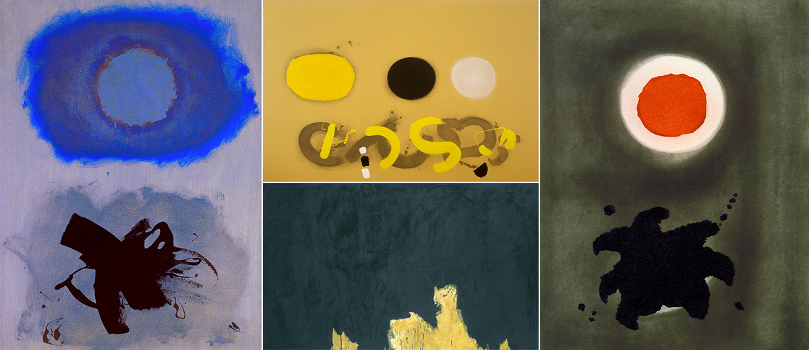

Arguably the highpoint of American Art in the 20th century, Abstract Expressionism represented an undeniable paradigm shift in the way the Western art world made and thought about art.

Abstract Expressionism was a new approach to studio art. All at once innovative, phallic, and raw, Ab-Ex generally presented little or no figurative elements, many times relying strictly on the "Painterly Gesture" of the artist.

The impact of Abstract Expressionism goes far deeper than studio art. One of the major contributions of the Abstract Expressionists was their bold and commanding use of color. When I'm stuck choosing colors for a project, I often reference works from this time. Because artists of this movement focused purely on form and process rather than figurative content, their use of color is often very communicative. Below are three of my favorite artists from this period.

Clockwise from top-left: Door to the River (1960), Gansevoort Street (1949), Seated Man (1939), Excavation (1950)

## Willem de Kooning

Willem de Kooning took color to another level. He worked with paint very loosely, and tried to keep the paint wet as long as possible. To that end he endlessly experimented with paint, adding cooking oils, turpentine drips, and endless amounts of medium and thinner. He also created very elaborate color charts which outlined and organized colors by their dry time.

This obsession with color shows in his work. He often uses warmer, more earthy colors such as Ochre, yellow, Burnt Sienna, and cream, but wasn't afraid of cool colors, or even pastels.

>"Style is a fraud. I always felt the Greeks were hiding behind their columns."

Even though he has been quoted as saying *"Style is a fraud"*, he certainly did have a style all his own. He didn't hide behind it, it was simply a byproduct of his innovation. Frequently the emotion and timbre of his color choice is what creates such a strong voice.

Color in his work has a life all its own. It is a central figure, almost completely unreliant on composition. Even though much of his work is moderately figurative, his use of color bring an expressive and bold voice to his work.

Clockwise from top-left: Blues (1962), Three Discs on Chrome Ground (1969), Transfiguration (1958), Mood (1967)

## Adolph Gottlieb

Adolph Gottlieb was an American painter who studied in New York but did most of his work in the Arizona desert. The sense of space in his paintings clearly reflects the immense environment that surrounded him day to day. The vast space he created in his "landscapes" often becomes purely abstract, reduced to its most basic form and color. He is considered one of the first color-field painters.

Gottlieb was a commanding colorist, even though his palettes often include very few colors. Color was especially important in his *Burst* series during the early seventies and this period in his career is a terrific cache of commanding and graphic palettes.

Clockwise from top-left: Number 11 (1952), Number 13A (1948), Lavender Mist (1950), Number 12 (1949)

## Jackson Pollock

Perhaps the best known of the abstract expressionist movement, Jackson Pollock is a commanding character in art history. Separating the man from the legend is difficult, but his use of color generally speaks for itself. Especially in his later work, when color really becomes one of the sole components of the work, his paintings have very compelling palettes.

Pollock did not work from color sketches (or sketches of any kind) in his later work, instead trying to paint *"from the subconscious".* His choice of paints was very experimental, ranging from oils to standard house paints. For this reason, the individual colors are sometimes stock from the factory, but the way he has combined them, they become something far different.

Cathedral (Detail) - 1957

Although many of his pieces are more earthy and warm with dark reds, creams, deep yellows, and forest greens, he did produce several works that are much more severe. *Cathedral*, a piece Pollock completed in 1947 (detail above), uses bright red, yellow, orange enamel, along with aluminum paint that is bright silver.

