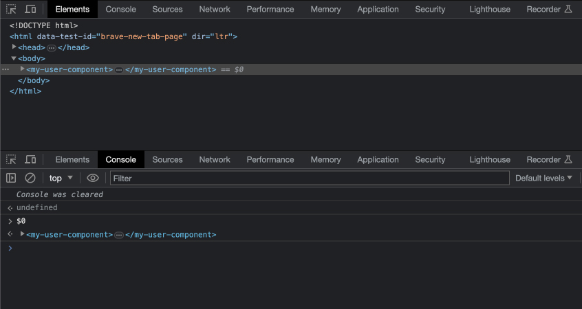

Recently I was pairing with a seasoned front-end developer and I told him to "just use dollar sign zero". He looked at me like I was having a stroke. Apparently, this is not a well known feature of Chrome DevTools (and other chromium-based browsers like Brave). Here's how it works:

1. In the Elements view of DevTools select the element you're interested in.
2. Go to the console tab.
3. Type `$0` and hit enter


<p class="caption">Look carefully to the right of the element, you'll see <code>== $0</code></p>


You'll see the same element logged! Indeed, Chrome even tries to helpfully let you know this feature exists by showing a `$0` to the right of the tag in the Elements tab.

You may have already known this, but I bet at least a couple developers will see this and their world will instantly become a brighter place.

## Why do I need this, though?

This trick has become essential to how I build now as I've been doing quite a lot of work with Web Components.

For example, let's say you wrote a component that accepts a user object like this:

```jsx
const user = {
  firstName: "Tobias",
  lastName: "Fünke"
};
return <my-user-component user={user} />
```

Another team asks why it's not working in their application. That can be a challenge to troubleshoot unless you run their project locally, and log the user object, etc. You can't see the user on the element in DevTools because JSX (or whatever library or hey maybe just normal JavaScript) will be adding that as a property, not an attribute.

With `$0` you can just select the component and write `$0.user`. To see what's being passed. You can also call any public methods, add child elements, or set a totally different user object to test things out.
