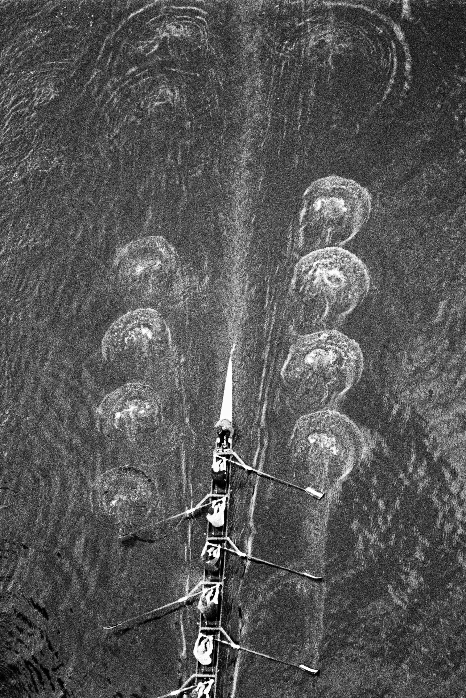
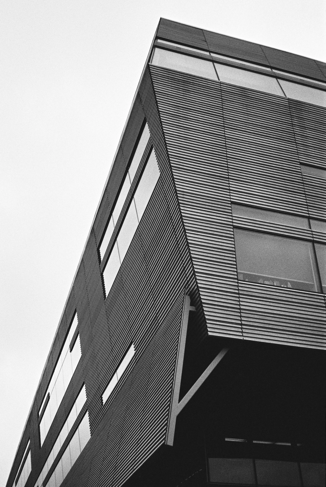
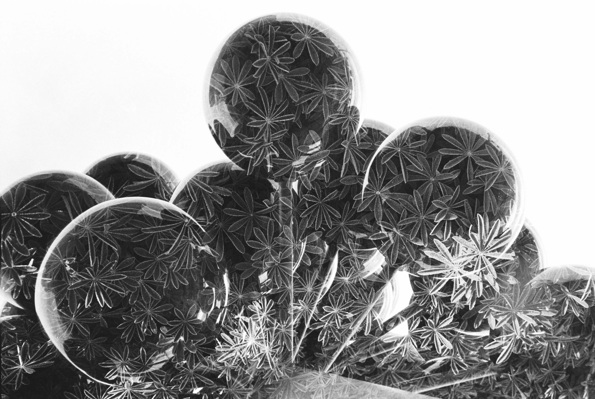
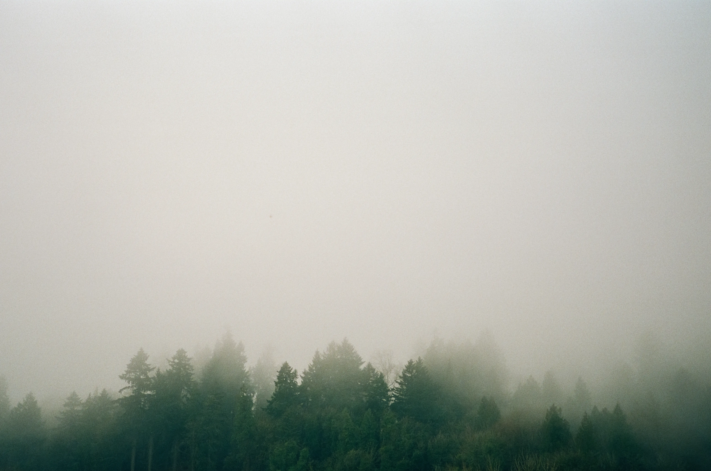
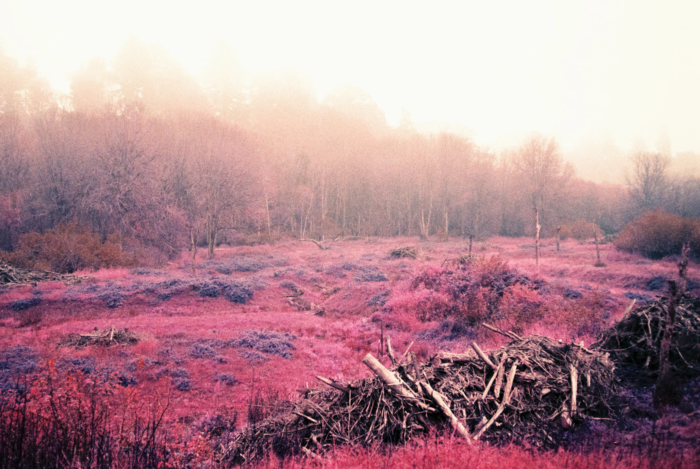
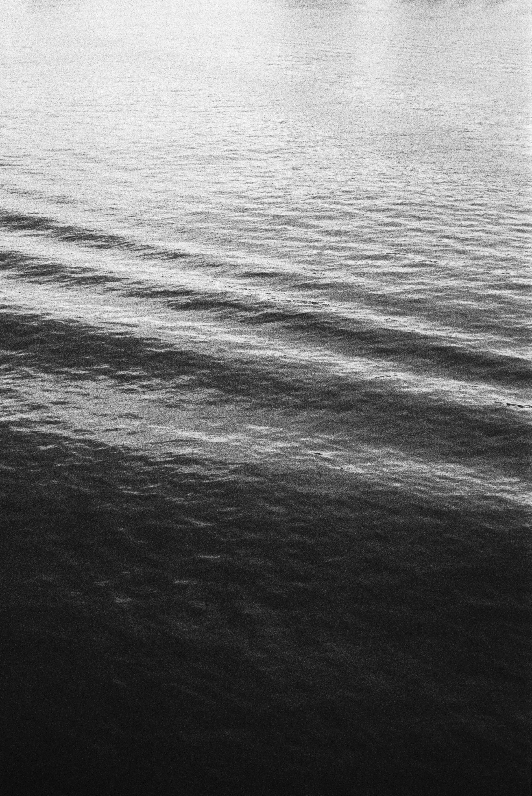
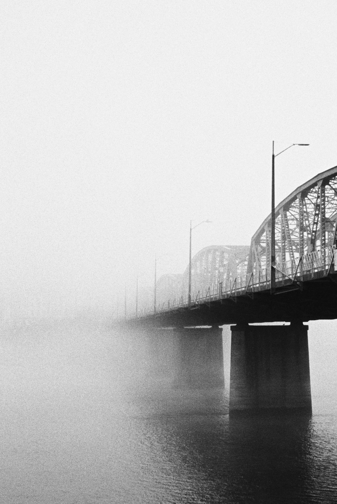
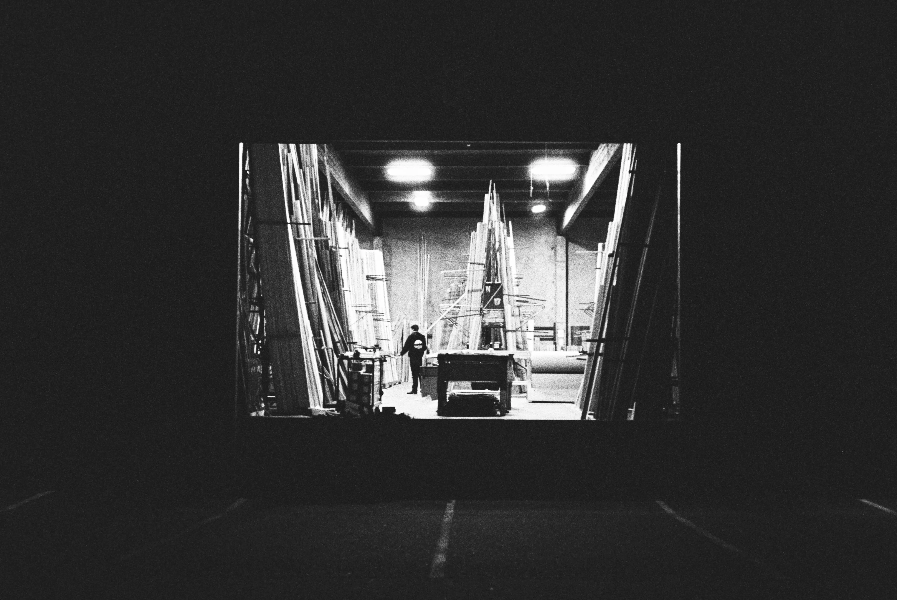

Over the past twenty years, I've gone through my share of cameras. I've used phones, digital cameras, medium format, rangefinders, plastic toy cameras, and disposable cameras. In 2018 I bought a Fuji Klasse S from Japan. When I clicked the buy now button I had no idea that this camera would end the revolving carousel of cameras and become my main carry-everywhere camera for eight years.

  
  
  

Kodak Tri-X 400 pushed two stops

## A Short History

Fujifilm first released the original Klasse in 2001. This was the height of color film sales, but the market share of digital cameras was growing at an exponential rate. It was a strange time where everybody knew that digital cameras would eventually be the future, but they just weren't as good as film yet.

By 2004 the first Klasse was discontinued. But in 2007, Fujifilm relaunched the Klasse in two versions: the Klasse S with a 38mm lens, and the Klasse W which featured a 28mm. They only made around 8,000 of the Klasse S, presumably because the film camera market had all but disappeared. They made these cameras as late as 2012. I cannot stress enough how late in the game this is for a company to be producing a consumer-focused film camera. So why build this camera? Here's how Fujifilm explained it (translated from Japanese):

> About 10 years ago, hyper-compact or high-end compact cameras equipped with high-performance, large-aperture lenses, aperture priority, and premium designs (titanium or magnesium) were popular.
>
> However, only a few of these cameras exist today. These cameras were expensive and not easily accessible to everyone who wanted them.

Fujifilm intended to bring great optics, premium build, and photographer-friendly shooting modes to the masses. The team perfected something that was already mostly dead. They used ideas from older cameras way up-market like the Contax T2 and made something premium at a lower price point.

I think they succeeded. Maybe they were too late for a market that was already going digital, but for people who want to shoot film, this is an incredible camera.

  
  

Leave the leader out on rewind and shoot the roll twice for double exposures.

## 1. Portable

You can easily take this camera anywhere. That is not true for most cameras. Many cameras _say_ they're portable, but you need the world's largest pockets to hold them. There is a reason that most photos taken today are taken on phones: _you have your phone with you_. Bringing along a camera where the lens protrudes from the body is a pain.

I have tried several other film cameras that are heralded as "portable" and most of them are very clunky to carry. They all but require a neck strap or a bag. The Klasse, however can be slid into your jacket pocket while you go about your day. I am still trying to find a digital camera that captures images onto a full frame sensor with a normal lens that is this small. Please let me know if such a thing exists...

  
  

Fuji color 200 and Porta 800

## 2. Easy

The Klasse S has one of the best shooting workflows (for me) that I've used. You can put it in full auto and not really think about anything ever again if you want to. If you need more control, you can set the aperture with a simple thumb dial on the top. Half press and you'll see what your shutter speed would be, adjust with the +/- exposure compensation if you need something else.

Loading film? Just put the film in, with the leader sticking out a bit and close the back. I never had this fail to load the film correctly.

You also get great control over other aspects of shooting. Want to push or pull? Just manually set the ISO via the menu on the top. This is stored internally and persists even if you power off the camera. No hacking codes on film canisters, just push a button and make it whatever you want.

To focus, just point the center at the element you want to focus on and half press. It almost always works exactly how you want it to. Reframe and shoot. This is a very simple, very accurate way to focus, and I love it. You can do this one-handed very easily. If you want to lock off focus to this distance, hit the AFL button (also easy with one hand). If all that doesn't work for you, just manually focus with a dial.

  

  
    

      
      
    

  

Lomo purple doing it's insane purple thing

## 3. Quality

The photos from this camera are so nice. The lens is sharp, but also allows you to go wide enough to get a little bokeh if that's your thing. This is a full frame image with great color reproduction. If the photo is bad, it's probably not the camera's fault.

It has a serviceable built-in flash. If you want this off, it _remembers that_ and won't turn it on randomly. This is something every camera should learn from. Respect my wishes for natural light, please.

The body is made of metal. It is covered in an almost perfect textured finish in places you need to hold it. The auto exposure brain in this thing is the best. It understands exposure much better than other point and shoots I've used over the years. Way higher ratio of keepers.

  
  
  

Under-exposing (Tri-x) two stops and pushing in development gives you enough elbow room for night photography.

## A Sad Ending

In the end, I'm moving away from shooting film. Mostly for reasons of cost. It is simply too expensive to shoot 35mm in 2026. If I add up the cost of the film, the processing, the scanning, and shipping to a lab, film is now well over $1 _per image_.

So I recently sold the Klasse S (thus the nostalgic blog post) along with my remaining film cameras and stock. I'm still figuring out how I'll approach photography now, but I hope to find something as good as this little point and shoot. Surely there must be something digital that has this much _class_.
