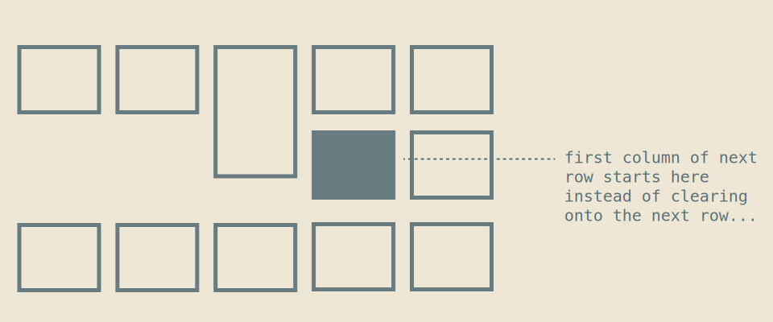

Recently, while working on [a side-project](http://www.pdxroasters.com/), I ran into a problem trying to clear columns of different heights while using a traditional float-based grid system. Upon hearing me complain aloud (a common occurence when I deal with css layout), [another developer](https://github.com/kitajchuk) I was working with at the time showed me an interesting ~~hack~~ solution to the problem which he had learned from a developer he had worked with. After much searching online, I couldn't find any occurence of this being written down, so I decided to put it on the internet for future generations.

### The Problem

The limitation I ran into while using a standard float-based grid is best described visually:



If one of your columns is taller than the others, the next row will start immediately after that column, instead of clearing to the next line.

This can be solved by adding an extra dom element to wrap the columns in each row and giving it ```clear:both```, or it can be solved with nth child selectors (ie. clearing every third item), or it could be solved with javascript plugins like [masonry](http://masonry.desandro.com/), but all of those solutions have their downsides. Either it's complicated, or it's not semantic, or it relies on javascript. Furthermore, as you make your pages responsive, these solutions become even more problematic. All the sudden there are different numbers of columns in the row and you have to change your dom and css for every breakpoint...

### Inline-block to the Rescue!

As it turns out, you can solve this problem by not using floats. Essentially, you give all the columns a display of inline-block and the columns will always wrap onto the next line below the tallest column above them. There is some sort of strange css voodoo to fix inline-block responding to whitespace, but all in all it's actually pretty simple:

```css
/* Main wrapper for grid */
.col-group {
  font-family: monospace; /* for spacing columns correctly */
  letter-spacing: -.65em; /* this too */
  margin-left: -1em;
  margin-right: -1em;
  text-align: left; /* center or justify for columns in last row */
  display: block;
}

/* Individual columns */
.col {
  font-family: Serif; /* be sure to reset the font and letter-spacing */
  letter-spacing: normal;
  display: inline-block;
  padding-left: 1em;
  padding-right: 1em;
  position: relative;
  float: none;
  text-align: left;
  vertical-align: top; /* align row's columns top or baseline */
  box-sizing: border-box;
}
```

Then you just need to set up some column width classes:

```css
.col1of1   { float: none; }
.col1of2   { width: 50%; }
.col1of3   { width: 33.33333%; }
.col2of3   { width: 66.66666%; }
.col1of4   { width: 25%; }
.col3of4   { width: 75%; }
.col1of5   { width: 20%; }
.col2of5   { width: 40%; }
.col3of5   { width: 60%; }
.col4of5   { width: 80%; }
.col1of6   { width: 16.6666%; }
.col5of6   { width: 83.3333%; }
.col1of12  { width: 8.33333%; }
.col5of12  { width: 41.6666%; }
.col7of12  { width: 58.3333%; }
.col11of12 { width: 91.6666%; }
```

And then, in your html, you can create a simple, smart, inline-block grid:

```html
<div class="col-group">
  <div class="col col1of2">
    <p>this will take up half</p>
  </div>
  <div class="col col1of2">
    <p>so will this</p>
  </div>
  <div class="col col1of4">
    <p>this is a quarter</p>
  </div>
  <div class="col col1of4">
    <p>and all</p>
  </div>
  <div class="col col1of4">
    <p>of these</p>
  </div>
  <div class="col col1of4">
    <p>as well</p>
  </div>
</div>
```

#### Additional Bonuses

You can easily control how the final row behaves in your grid. If you want it to center the remaining columns, you can use ```text-align: center```. If you want to make them take up the whole row, just use ```text-align: justify```.

You can also control how each column is vertically aligned in the row. If you'd like the columns to be aligned on the baseline, instead of the top, use ```vertical-align: baseline``` on the column class.

If you're using borders and padding, you can also use ```box-sizing: border-box``` to make the box model more straightforward.

Check out [this jsfiddle](http://jsfiddle.net/9U6v5/25/) to see it in action. (Or see the full screen result [here](http://jsfiddle.net/9U6v5/25/show/).)


