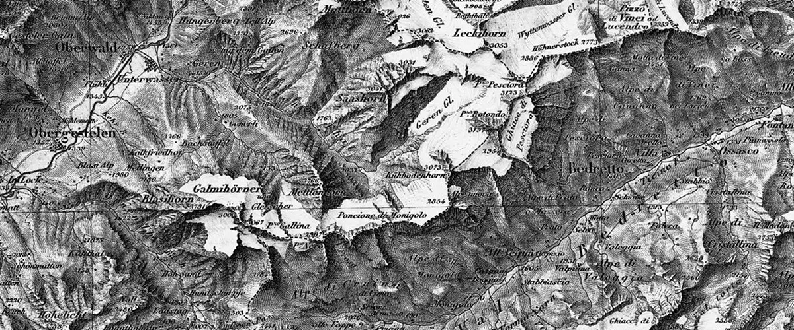
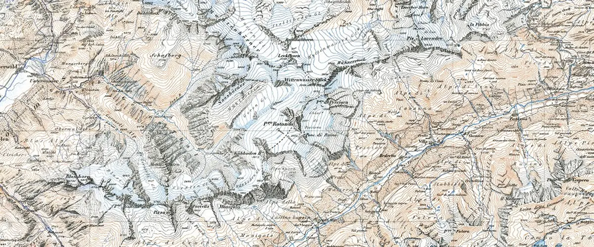
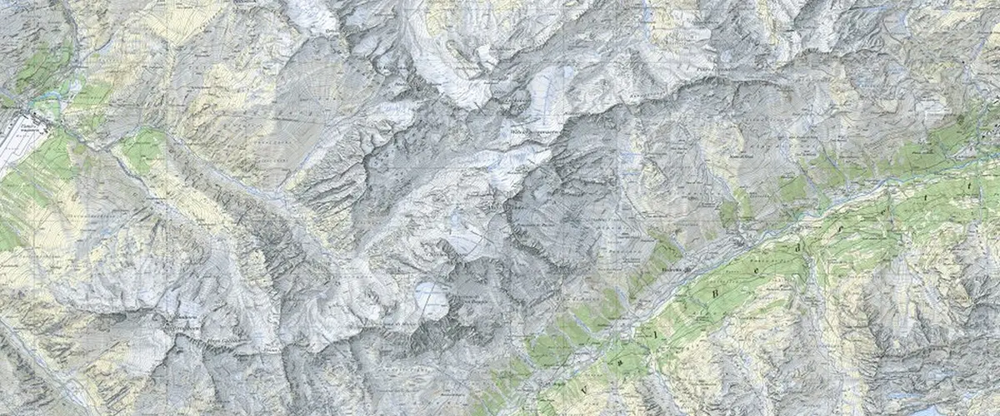

Switzerland has become known for beautiful cartography. It should come as no surprise (seeing that their nation is almost entirely mountainous) that their presentation of relief is especially effective. The vast changes in elevation presented in this relatively small country necessitate huge amounts of work and thought on the part of cartographers.

General Guillaume-Henri Dufour founded the Federal Office of Topography in 1838, which published its first map in 1844. After an extensive effort, the entirety of Switzerland had been mapped by 1864. Generally, the office began work on a new map immediately after they had finished the old map. Most of the time the country was using two maps at the same time, some areas having the older map and some areas having the newer map. Below are the three major maps that were completed and their use dates.

### Dufour Map

  The Dufour map was used from 1844 until 1939.

Although the first surveys of Switzerland took place as early as 1809, it wasn't until the Topographic Bureau was formed in 1838 that maps began to be published. The Dufour Map was initially reproduced by intaglio. It was monochromatic until 1908 when a single spot color was added.

The Dufour Map (named after the first leader of the Office of Topography, General Guillaume-Henri Dufour) was finished in 1864, and a year later, its namesake General retired and a new map was begun.

### Siegfried Map

  The Siegfried map was used from 1870 until 1949.

Its publication was begun by the Federal Topographic Bureau under Hermann Siegfried, and continued from 1870 to 1922.

The Siegfried Map added contour lines to symbolize relief as well as three colors for printing. These color allowed the map to use brown for contour lines on vegetation, blue for contour lines on water and glaciers, and black for lines on everything else.

### National Maps

  The National maps were used from 1938 and are still used today.

Made by Swisstopo, each national map is based on the Mercator projection. Introduced in 1938, the maps are constantly being updated so every map receives updates at least once every six years. First, they were 1:50,000 scale. 1:25,000 scale was introduced in 1952. The colors for the National Maps are especially beautiful and communicative. Contour lines are evident, but not overpowering.
