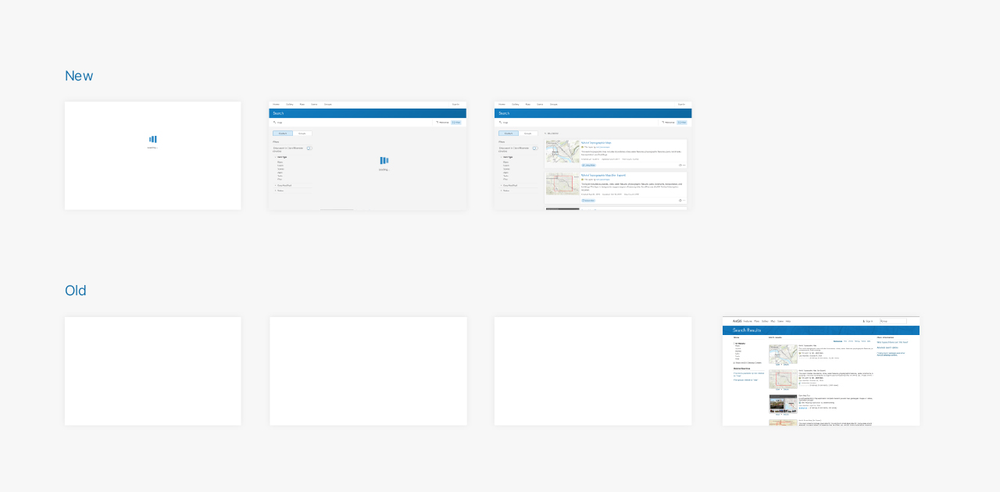

## Summary

For the past three years I've worked as a designer/developer for ArcGIS Online, an application that helps organizations collaborate, share, manage, and collect GIS data. I joined the team just in time to help with a massive redesign/refactor. The question was: how does a small team redesign a complex application while it's being used by _millions of people_ all across the planet?

Now we're several years into the project and I'm extremely proud of the progress that's been made and my role in improving the product for all of our users.

## Design

Side by side showing before and after of one page in the application

When I arrived to the team, ArcGIS Online used a stock widget theme for it's styling. There was no styleguide or design system and all typography used an off-brand system default (not that there's anything wrong with [using system fonts](https://github.com/paulcpederson/blog/blob/master/source/scss/base/_typography.scss)!).

Luckily I had already created [Calcite Web](/work/calcite-web) while working on/starting-up [another Esri product](https://developers.arcgis.com/). This meant I had a great headstart for colors, typography, grid, and some basic design patterns.

Item card before and after. 

For the aforementioned widgets, I created a custom theme matching the Calcite look and feel. Adding more generous whitespace, using a modern sans-serif typeface, and updating small bitmap icons with clean vector icons went a long way towards modernizing the look and feel of the product.

### Componentization

Illustration of how components on one page of the new design are organized

As with any codebase, there was a good deal of technical debt that needed dealt with. One of the biggest roadblocks for performance as well as developer productivity was the fact that most pages were single monolithic files (10k+ LOC!) with very little shared code.

We factored these large files into smaller UI components which could be reused and shared across multiple pages. This made future development much faster and also enabled us flexibility when it came to updating our production build layers as we could much more intelligently optimize what got shipped to our users and how it was bundled.

This new component architecture lead to dramatic improvements in load time (> 50% in most cases) and enabled us to move much more quickly through the redesign process with more consistent interfaces site-wide.

### Intentional empty/loading states

Before and after filmstrip view of the app while loading.

Prior to the rewrite, there was not a lot of feedback to users when work was underway. This was especially evident during initial page load. The page was completely white up until the point where all content was loaded and ready. By adding a small loader to the page, which rendered immediately, the app appeared much more performant than if users were stuck staring at a blank screen.

Empty states and default images/avatars were another way in which we were able to create a more friendly experience. For example, prior to the redesign all user avatars, unless the user had uploaded a photo, were the same grayed out faceless illustration. This made lists of people extremely hard to parse as there was nothing visual which distinguished one person from another other than the actual text of their name. Imagine being in an organization of 10,000 people and finding the correct person in a sea of gray avatars!

User avatars before and after

To solve this problem, I developed a client-side strategy where the user's unique id field was used to generate a hex color background. We then added their initials on top of this color, providing a consistent visual indicator that made finding a user or group much easier.

### Responsive

A huge range of screensizes are now supported.

Like many sites created prior to the rise of responsive web design, the previous designs were based on a max-width of `960px`. This meant that on phones and tablets, the site would scroll, and on large desktops the site was using a very small percentage of the screen real estate.

By using a flexible-width grid along with a responsive navigation and layout, we were able to make the app usable from phones all the way up to very large displays.

### Accessibile

Managed to get 100/100 in the Chrome audits tab!

When we began work, accessibility was starting to become very important for many organizations. Customers were beginning to ask for more accessible web experiences. As we redesigned and reimplmented legacy interfaces, we also made an effort to ensure the new work would be WCAG 2.0 AA-compliant. This meant using accessible contrast, ensuring screen reader support, and taking care to structure the application markup semantically.

Aside from the obvious benefits of making the application work better for a larger swath of the population, we found that many aspects of accessible web experiences were also appreciated by power users (think focus styles and good keyboard navigation).