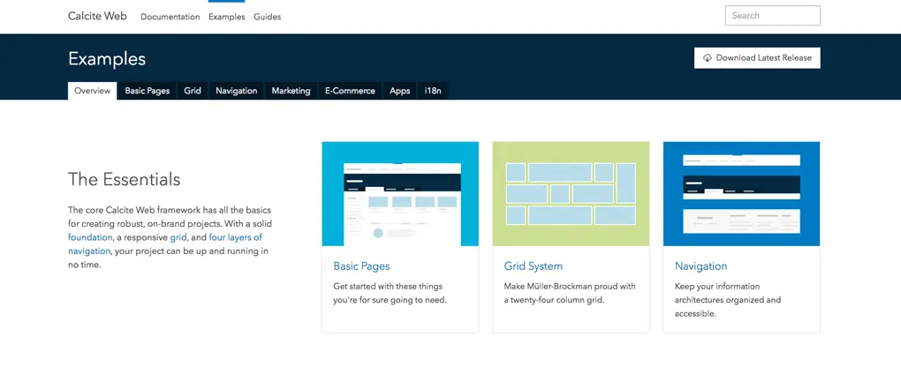
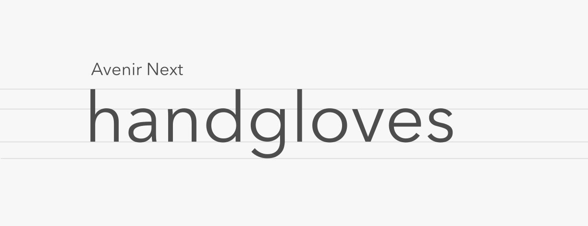
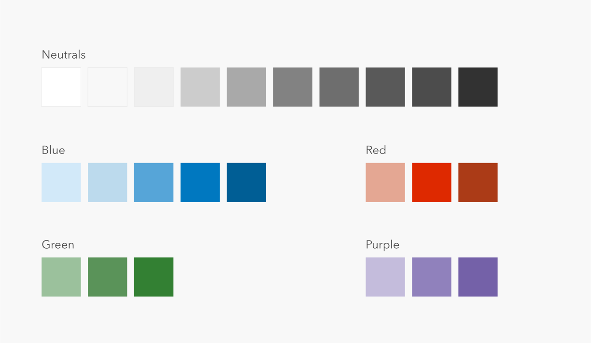
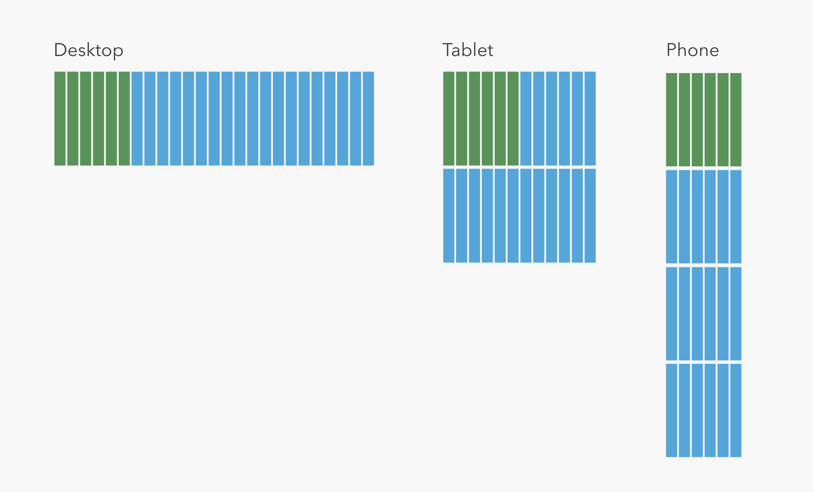

<strong> ⚠️ Calcite Web has now been replaced with the more robust [calcite design framework](https://developers.arcgis.com/calcite-design-system/). While the subject of this post is no longer in active use, proud of how design thinking continues to evolve at Esri from these humble origins. ⚠️ </strong>

## Origins

When I joined Esri more than three years ago there was no official design language or web style guide. Esri is a large organization, with partners all over the world, offices in several countries, and thousands of web properties, so without an official set of interface components and visual styles you can imagine what was happening. Teams were reinventing the same wheel fourteen times, and none of them looked or worked the same. As a user, navigating through all of these sites was difficult. Tabs worked one way on this site, and another way on that site. From a brand perspective, most teams hadn't read the official brand style guide, which meant that as a brand, Esri felt chaotic and confusing.

I was tasked with developing a CSS framework that could codify these design decisions and make it easy to create an Esri branded website. Teams around the world could copy and paste patterns and components to quickly build sites that they knew would be lightweight, consistent, and beautiful. As teams move their existing sites over to Calcite Web, Esri's web presence slowly becomes better and better with each migration.

## Design

  

Design documentation

Esri had a very lengthy brand style guide (we're talking ninety-seven pages) which defined everything from letterheads to email signatures. Conceptually, this framework would need to be an extension of those ideas.

A great deal of work had also recently gone into redesigning [ArcGIS Pro](http://www.esri.com/en/software/arcgis-pro), Esri's relatively new desktop GIS offering. They had developed an extensive set of guidelines for icons, color, and interface concepts. They called these design ideas "Calcite".

Our design would have to be consistent with both of these documents, while also forging ahead in some some areas that hadn't been defined yet like motion and animation.

### Type

Avenir's geometric shapes and rational design make it feel very modern.

Esri has been using Avenir since way before it was cool. The clean look of Avenir is very modern, so there was no need to throw out Avenir.

We selected Avenir Next, which is an update of Avenir by Frutiger himself (with help from Kobayashi) that is specifically meant for screen use. This also added support for Cyrillic characters, which meant much less gymnastics for eastern European localization.

### Color

Spot colors are derives from lights and darks off of Esri's key brand colors.

The palette is all about grayscale with pops of color throughout. The most common color for active states is the main blue spot color. Patterns are constructed to be as neutral as possible, so that the patterns and components of the framework work well regardless of the color scheme of the app they sit inside of.

### Grid

Columns shift depending on screen size automatically.

The grid is a unique part of this project. It starts as a twenty-four column grid, but as the screen size changes, column size changes as well. It's pretty common for grid systems to just snap to full width around tablet size and call it a day. The way that the Calcite Web grid works is a bit more sophisticated.

Instead of changing how large columns are, we actually change the number of columns in each breakpoint. On larger screens and desktops you get twenty-four columns, but on tablets the count goes down to only twelve columns. The column count decreases further on a phone to just six. This means that a six column element will be a quarter of the screen on large sizes, half the screen on medium sizes, and the whole screen on a phone. It's a unique system that works quite well in practice.

## Development

I also worked to develop the entire framework. There is quite a bit about it that was very engaging from a development perspective.

### Sass

The styles are all built in Sass. I love Sass. I'm a node-sass contributor, and I've used sass for almost four years now. The relatively new addition of LibSass removed the Ruby dependency and made it way faster. Variables, imports, and mixins are the features I use the most. Sass enabled us to create a framework that could be configured by the developer to generate only the CSS they needed as well, which is really cool.

### Universal Everything

The main goal of Calcite Web was to be as tooling/framework/language agnostic as possible. To that end, it's available as a Gem, an npm module, on a CDN, and downloadable via GitHub releases.

The JavaScript declares itself using UMD. That means AMD, CommonJS, and even people who just throw things right on the `window` can use it in whatever way they're used to.

### Accessibility

This was the first project I worked on that was seeking WCAG level AA certification. I don't think we are perfect in this regard yet, but I've learned a ton along the way about building accessible UIs.

## Conclusion

Use of Calcite Web at Esri continues to grow. Each month more sites are completed and we move toward a more user-friendly web presence. I've received a huge amount of positive feedback from other teams, and also from customers directly. While it probably won't ever be "done" as it is a living styleguide, I like where we've arrived, and I enjoy using the framework myself, which is a good sign.

[View the documentation](http://esri.github.io/calcite-web)

