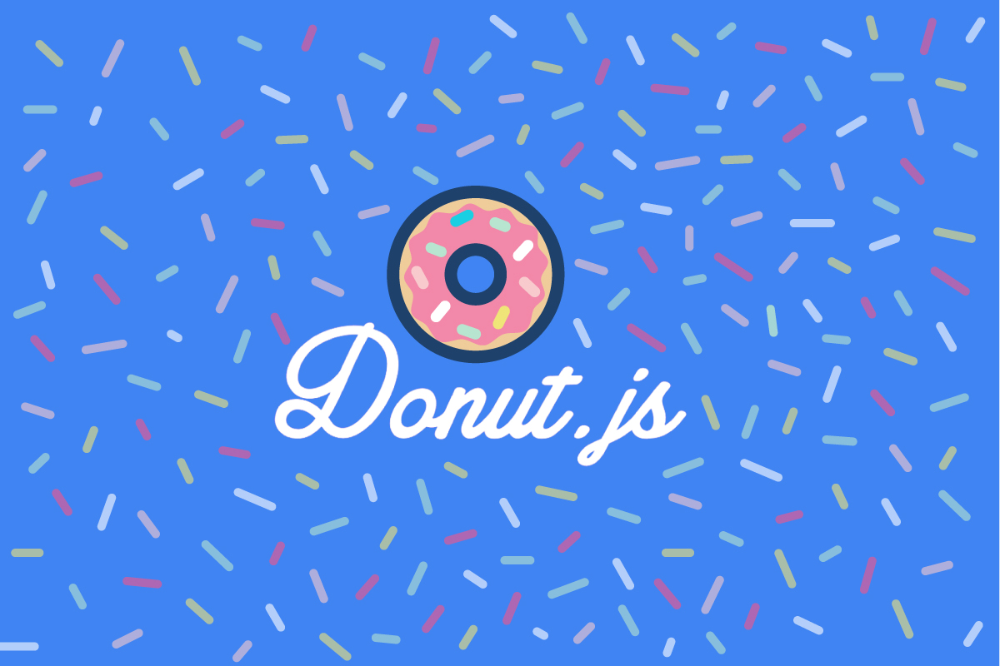

## Origins

I actually found this project on Twitter. Somebody I follow retweeted the organizer saying they were looking for some design work for their meetup. It's always fun to keep the design and branding skills sharp, so I dove into it pretty hard. Plus they give all of their profits to charities like [Chick Tech PDX](http://portland.chicktech.org/), it's awesome!

## Branding

The brand is entirely built around a flat, clean, vector illustration style. Chunky, fun, modern, and pretty wacky was the goal. Started with the logotype, I felt like a cursive, retro baseball script worked well.

This adds a bit of humanity to the brand. Using a geometric sans or a grotesk would have made it feel sterile. Remember, this is about real people getting together in real life to eat real donuts!

From there I developed the logo itself. I knew I wanted to use a donut with sprinkles. Donuts are perfectly round and fairly iconic on their own, so I knew it would play well at small sizes and on laptops and such.

The color palette is built off white on a very strong electric blue. There are a handful of grays, and then all the supplemental colors are generated from the sprinkles.

I wanted to embrace the pastels that are often used for sprinkles, because you don't often see tech industry branding use pastels, so it's different and fun.

The primary brand face is [Mikado Bold](https://www.myfonts.com/fonts/hvdfonts/mikado/bold/) which is just about as chunky and fun as you can get.

I also created a brand ambassador named Donny the Donut™, as well as a ton of other smaller illustrations (Donny doing things, more donut styles, etc).

## Web

The site requirements were pretty simple. The site just had to have a couple links at the top, a block about the next event, a design for the schedule, and a block with other more general information about Donut.js. I did use a couple new technologies just for fun.

### Flexbox

The top navigation uses flexbox for layout. I had never used flexbox before so this was a fun little trial. It really makes some things *much* easier than the CSS of the past (think vertical centering, fixed plus flexible layouts).

### Canvas

Somebody suggested that it would be fun to have procedurally generated sprinkles in the background of the site. I used canvas for [Sound Finder](./sound-finder/), so I knew that Canvas could handle the challenge. It was pretty straight forward, essentially generate a certain number of sprinkles (lines with rounded stroke) in an array. Update their positions so that they look like they're falling. When they fall below the bottom of the screen, update their position to above the screen, so that they fall forever.

