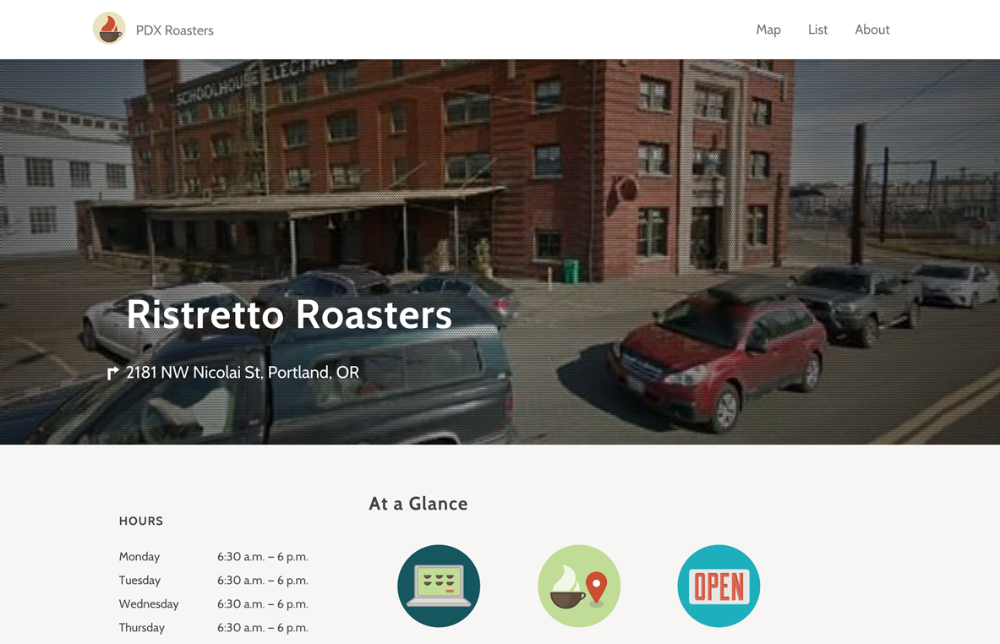

## Origins

This project started as the vision of my friend [Isaac Viel](http://isaacviel.name/). It's essentially meant as a way for Portlanders—and those just visiting—to find a great cup of coffee.

Isaac generated all the content and [another great developer](http://www.tristanwaddington.com/) friend of mine did all the back end. I got to work on the design front end bits.

## Development

There were a number of fun challenges for this project. Side projects are always fun, and this was no different.

### Leaflet

One of the most useful ways of working with a set of locations like this is obviously in a map view. My mapping API of choice is generally [Leaflet](http://leafletjs.com/). It's lightweight, simple, fast, and works well with a variety of tooling sets and development styles. It has a really beautiful API that is just big enough to do most of what you'd need to do with a map, but small enough that all the name spaces and methods can fit on the screen at once.

Essentially you create a map, add some controls, and then after that almost everything is just a layer on that map. It's a good model that works well for simple use cases especially, but it also has a really nice ecosystem of plugins if you need more. It even has a `map.locate()` method which uses the [Geolocation API](https://en.wikipedia.org/wiki/W3C_Geolocation_API) to locate a user's browser.

### Performance

I did a pretty major refactor focusing on performance and load time a while back, and I learned quite a bit. While I worked, I did some bench marking of before and after:

#### JS

| Version | Requests | Transferred | Latency |
| ------- | -------- | ----------- | ------- |
| **Old** | 8        | 245KB       | 436ms   |
| **New** | 1        | 132KB       | 23ms    |

#### CSS

| Version | Requests | Transferred | Latency |
| ------- | -------- | ----------- | ------- |
| **Old** | 2        | 43.2KB      | 189ms   |
| **New** | 1        | 28KB        | 23ms    |

#### XHR

| Version | Requests | Transferred | Latency |
| ------- | -------- | ----------- | ------- |
| **Old** | 1        | 97.6KB      | 2.03s   |
| **New** | 0        | 0           | 0       |

Removing requests, ensuring that you have gzip working, and removing third party dependencies entirely are all good ways to improve performance. While I was working I played with some really nice performance testing tools, especially the PageSpeed Chrome extension which gives you PageSpeed insights directly from your dev tools.

### No jQuery

The initial version of the site used jQuery for AJAX form submission and DOM manipulation. I decided it would be a fun challenge to remove jQuery and replace it with Vanilla JavaScript. The most challenging thing to replace was form submission. Working with `XMLHttpRequest` directly is still a bit cumbersome, but it's not too bad once you get your head around it. In the future, hopefully the [Fetch API](https://davidwalsh.name/fetch) gets wider support and we can all just start using that soon.

### Django

  

When there is no image of the roaster, the background image is generated with the <a href="https://developers.google.com/maps/documentation/streetview/">Google Maps Street View Imagery Service</a>.

The back end is built in Django, and this was my first time using that. It's actually a really great CMS/back end solution. The admin interface, while a bit homely, is very functional, and working with their templating system (DTS) is really nice.

Creating individual views for all of the roasters was very simple.

## Conclusion

We've had a lot of positive response from people who say they use the site all the time. It's become a very useful tool for people who are are a part of the Portland coffee world. If you're into coffee, [check it out](http://www.pdxroasters.com/)!